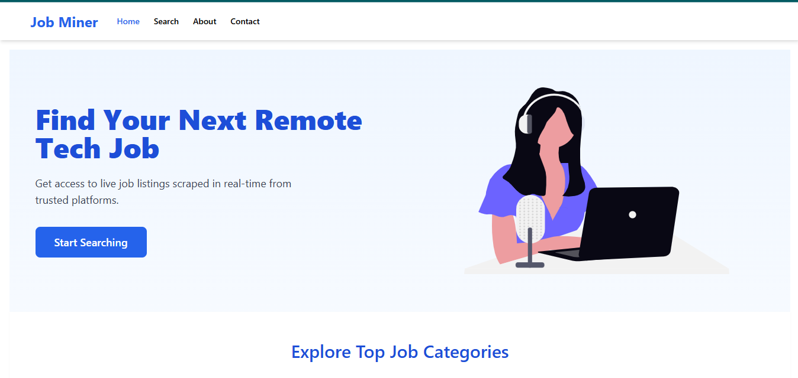
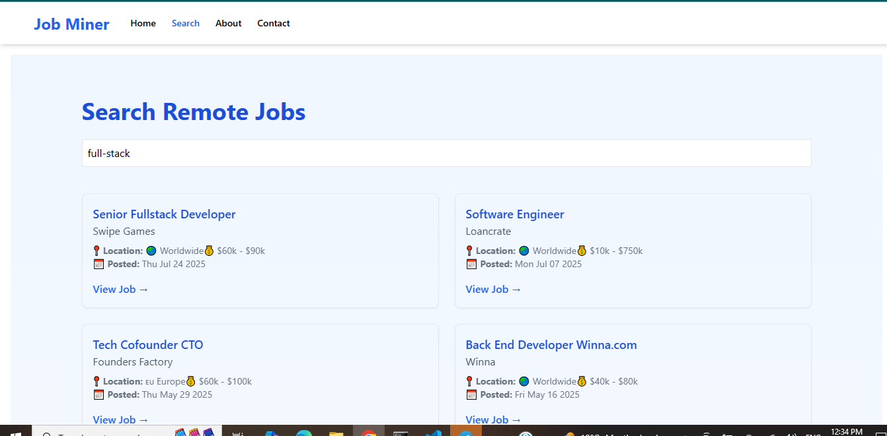
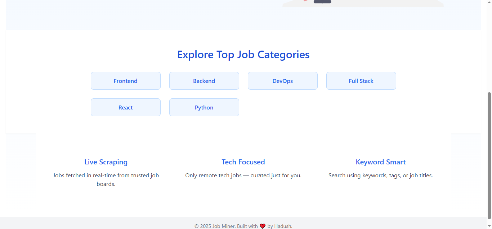
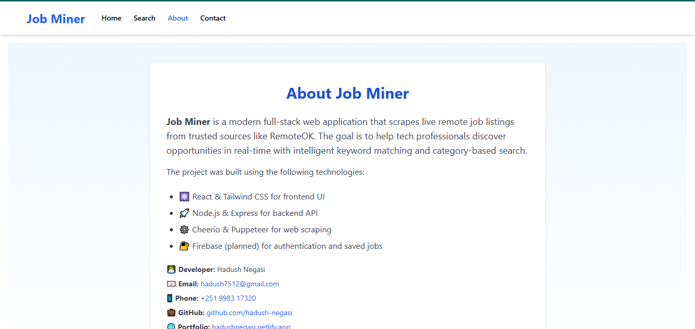
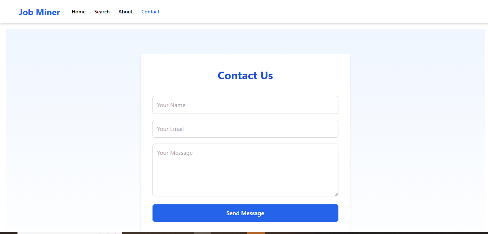

# 🛠️ Job Miner – Real-time Remote Job Scraper

Job Miner is a full-stack job search web application that scrapes **live job listings** from [RemoteOK](https://remoteok.com). Users can search by tech-related keywords like "React", "Python", "Backend", and more.

Built as a portfolio project to demonstrate full-stack development, real-time web scraping, and modern UI design.

---

## 🚀 Live Demo

- 🌐 Frontend (Netlify): [job-miner.netlify.app](https://job-miner.netlify.app)
- 🖥️ Backend (Render): [job-miner-api.onrender.com]

---

## 🖼️ Screenshots

### Homepage


### Job Search


### Homepage 


### About Us Page


### Contact Us page


---

## 🧱 Tech Stack

### Frontend:
- React + Vite
- TailwindCSS
- Framer Motion
- Axios

### Backend:
- Node.js
- Express.js
- Cheerio (Web scraping)
- Puppeteer (planned for advanced scraping)

---

## 📁 Folder Structure

```
job-miner/
├── client/                # React frontend
│   ├── components/
│   ├── pages/
│   ├── assets/
│   └── ...
├── server/                # Node + Express backend
│   ├── scraper/
│   ├── controllers/
│   └── ...
├── .gitignore
├── README.md
├── package.json
└── ...
```

---

## 🔧 Features

- ✅ **Live scraping** from RemoteOK  
- ✅ **Autosuggest** search input  
- ✅ **Keyword-based** job filtering  
- ✅ **Loading spinner** and UI feedback  
- ✅ **Deployed** frontend + backend  

---

## ✍️ Author

- 👨‍💻 **Hadush Negasi**  
- 📫 Email: [hadush7512@gmail.com](mailto:hadush7512@gmail.com)  
- 🌐 Website: [hadushnegasi.netlify.app/](https://hadushnegasi.netlify.app/)  
